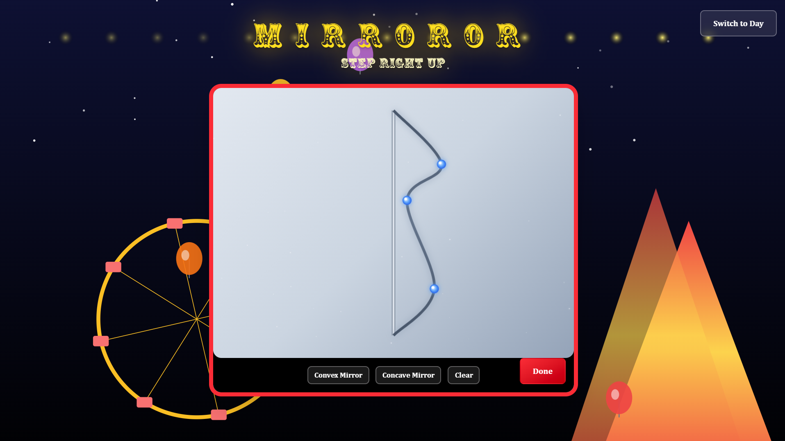

# 🎪 MIRROROR - Carnival Funhouse Mirror Experience

A interactive web application that lets you design custom funhouse mirror curves and apply them to your webcam in real-time. Built with React and Vite, featuring a whimsical carnival theme complete with floating balloons, a ferris wheel, and twinkling stars.



## ✨ Features

- 🪞 **Custom Mirror Designer** - Create curved mirror effects with an intuitive point-and-drag interface
- 📹 **Real-time Webcam Distortion** - Apply your custom mirror curves to live webcam footage
- 🎨 **Carnival Theme** - Beautiful animated background with day/night modes
- 🎈 **Dynamic Animations** - Floating balloons, rotating ferris wheel, and twinkling stars
- 💾 **Curve Export** - Mirror curve data automatically syncs between designer and webcam

## 🚀 Getting Started

### Prerequisites

- Node.js (v14 or higher)
- npm or yarn
- A webcam (for the mirror effect feature)

### Installation

1. Clone the repository:
```bash
git clone <your-repo-url>
cd HackBeanpot-2026
```

2. Install dependencies:
```bash
npm install
```

3. Start the development server:
```bash
npm run dev
```

4. Open your browser and navigate to `http://localhost:5173`

## 🎮 How to Use

### Designing Your Mirror

1. **Click** on the left side of the canvas to add control points (maximum 2 points)
2. **Drag** the red control points to adjust the curve shape
3. **Drag** the golden star to adjust the center point
4. **Right-click** on a control point to remove it
5. Click the **"Done"** button when you're satisfied with your design

### Using the Webcam Mirror

1. After clicking "Done", the webcam interface will appear
2. Your custom mirror effect will be applied in real-time!
3. Click **"← Back to Designer"** to adjust your mirror curve

### Day/Night Toggle

- Use the **"Switch to Day/Night"** button in the top-right corner to toggle between carnival themes

## 🛠️ Tech Stack

- **React** - UI framework
- **Vite** - Build tool and dev server
- **Canvas API** - For mirror curve drawing and webcam distortion
- **WebRTC** - For webcam access via `getUserMedia()`
- **Tailwind CSS** - Styling and animations
- **SVG Animations** - For carnival background elements

## 📁 Project Structure

```
src/
├── assets/           # Static assets
├── shaders/          # GLSL shaders for mirror effects
│   ├── curved_mirror_vertex.glsl
│   └── square_mirror_fragment_asym.glsl
├── App.jsx           # Main application component with carnival theme
├── App.css           # Global styles
├── MirrorCurveDesigner.jsx    # Mirror curve design interface
├── FunhouseMirrorWebcam.jsx   # Webcam with mirror distortion
├── main.jsx          # Application entry point
└── index.css         # Base CSS

public/
└── fonts/
    └── Circus-gwK5.ttf    # Custom carnival font
```

## 🎨 Key Components

### MirrorCurveDesigner
- Interactive canvas for designing mirror curves
- Catmull-Rom spline interpolation for smooth curves
- Symmetrical or asymmetrical curve generation across horizontal axis
- Constraint system to prevent invalid curves

### FunhouseMirrorWebcam
- Real-time webcam feed processing
- Pixel-by-pixel distortion based on mirror curve data
- requestAnimationFrame for smooth rendering

### App (Carnival Scene)
- Live Ray Tracing straight from your camera 
- Day/night theme switching
- Floating balloons with independent physics
- State management for mirror curve data

## 🔧 Configuration

### Canvas Settings
```javascript
const WIDTH = 800;
const HEIGHT = 600;
const LINE_X = 400;  // Mirror center line position
```

### Curve Constraints
```javascript
const MIN_DISTANCE_FROM_AXIS = 50;      // Minimum Y distance from center
const MIN_VERTICAL_SPACING = 50;        // Minimum spacing between points
const MIN_DISTANCE_FROM_VERTICAL = 30;  // Minimum X distance from edge
const MAX_Y_POSITION = LINE_TOP + 50;   // Maximum height for points
const MAX_LEFT_DISTANCE = 200;          // Maximum leftward displacement
```

## 🐛 Troubleshooting

### Camera Access Issues

**"Requested device not found"**
- Ensure a webcam is connected
- Check browser permissions (allow camera access)
- Use HTTPS or localhost (required for camera API)
- Close other applications using the camera

**"Camera access denied"**
- Click the camera icon in the browser address bar
- Grant camera permissions
- Refresh the page

## 🎯 Future Enhancements

- [ ] Save and load custom mirror designs
- [ ] Photo capture with mirror effects
- [ ] Video recording with distortion
- [ ] More carnival background themes
- [ ] Mobile touch support for mirror designer
- [ ] Export mirror effect as video filter

## 📜 License

MIT License - feel free to use this project for learning or fun!

## 🙏 Acknowledgments

- Carnival graphics inspired by classic amusement parks
- Catmull-Rom spline implementation for smooth curves
- WebRTC camera access via modern browser APIs

## 🤝 Contributing

Contributions are welcome! Feel free to:
- Report bugs
- Suggest new features

---

**Made at HackBeanpot 2026**
